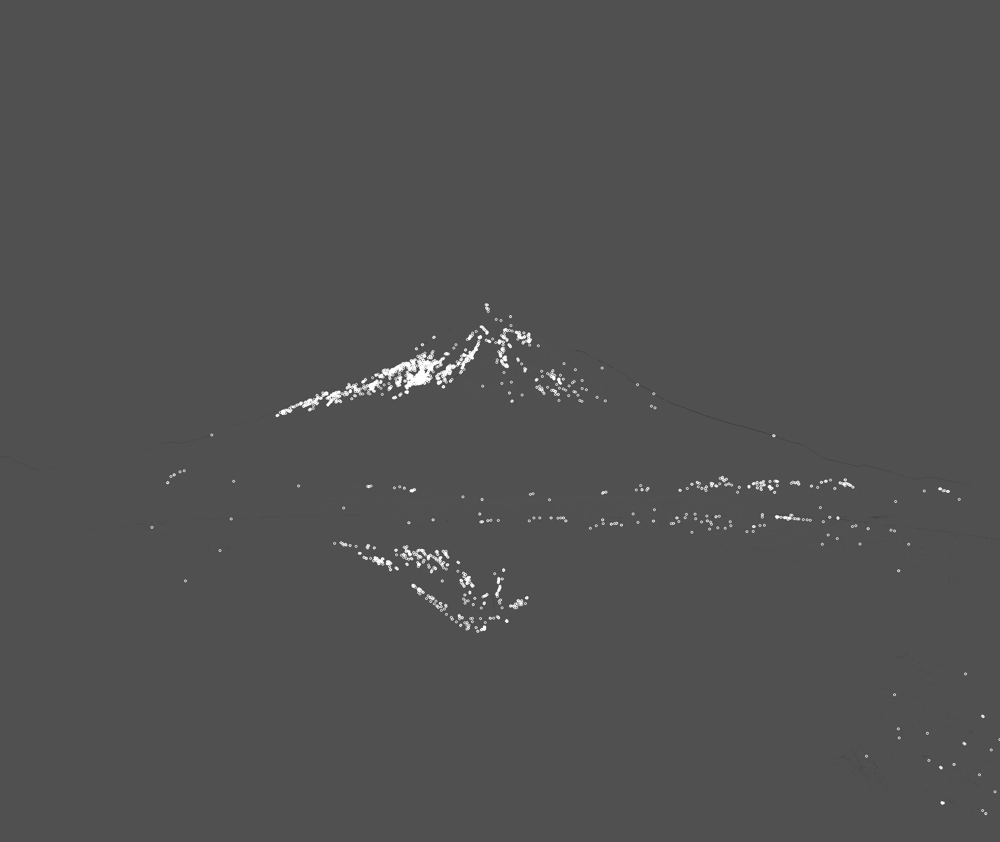

# Image Corner Detection

Using Harris Corner Detection method to detect corners in an image. Since corners are variation in gradients, this methods looks for this variation.

## Original Image

## Corner Detection

